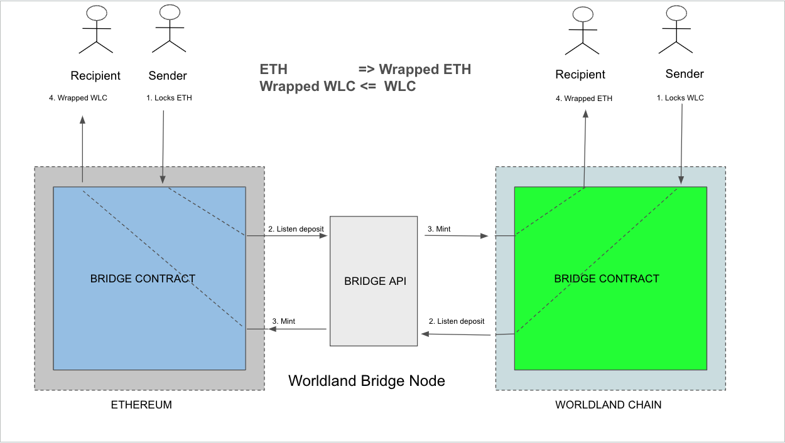
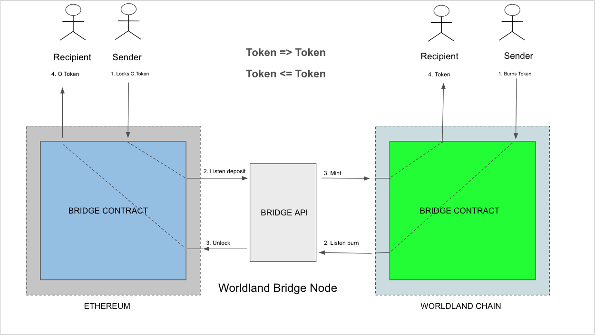
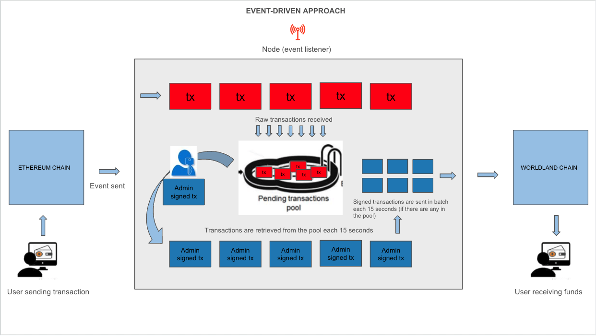
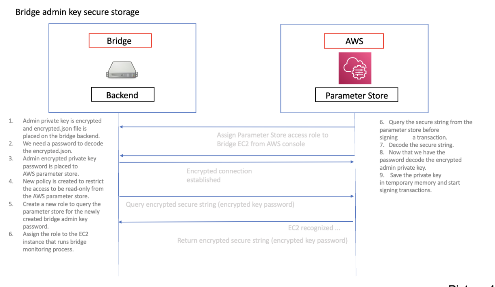
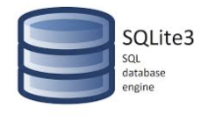
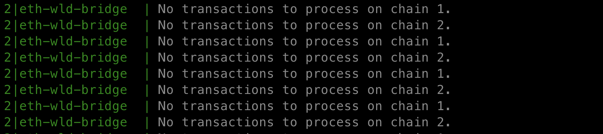
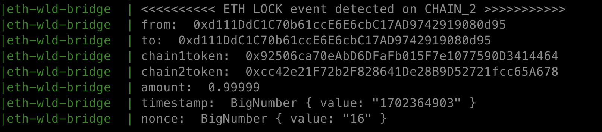
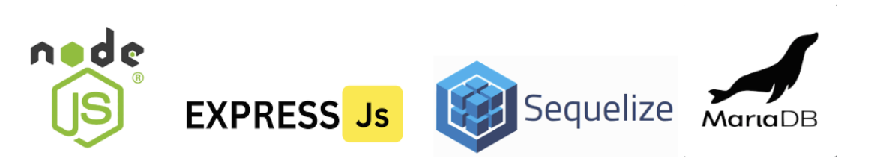
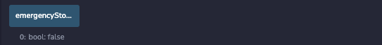

## Worldland-Ethereum Bridge

Technical Documentation

version 3.0

The BridgeBase is a major contract forked from Cosmos Gravity Bridge that holds the main functions and stores the users' funds.

- The BridgeBase contract has to be deployed both on Ethereum and Worldland and a separate node has to be started to listen to events coming from contracts.

There are two main functionalities:

### - ETH to Wrapped ETH transfer:


Picture 1

The flow is quite simple, the sender (see step 1 in the picture) calls the lockETH function within the Bridge contract on Ethereum network and sends an amount of ETH to the contract, the lockETH function subtracts bridgeFee and networkFee along with the requested amount from the sender’s balance. The lockETH function emits an ETH transfer event which is picked up by Worldland Bridge Node. It then mints wrapped Eth on the tendermint chain (Worldland) to the user address.

If a sender wants to get their funds back on Ethereum they call burnWETH function in BridgeBase contract on Worldland that burns their wrapped eth, subtracts bridge and network fees and emits burn event which is then picked up by node and the amount of locked eth is sent from the contract on Ethereum to the user address.

### - Token to Token transfer:


Picture 2

The flow is pretty much similar to ETH to WETH transfer. The original tokens are locked in Ethereum and the same amount is minted on the tendermint chain (Worldland). If a sender wants their tokens back on Ethereum they burn a specific amount on the Worldland deployed BridgeBase contract and node(signer) will transfer the token amount from the contract to the user on Ethereum. (Bridge and Network Fees are subtracted upon token transfer)

## ERC20 / WETH contract deployment and ownership transfer

- ERC20 / WETH contracts are mintable

Steps to complete the process:

1. Deploy ERC20 / WETH contracts

2. Call the transferOwnership function in ERC20 / WETH contracts with the BridgeBase contract’s address as a new owner of the tokens.

- Now the BridgeBase contract has a minting and burning privileges of ERC20 and WETH contracts

## Node(signer)


Picture 3

Encrypted owner private key is stored on the server.

In order to start the bridge process, we have to decode the owner's encrypted private key (stored in the server) with a password that is stored in the AWS Parameter Store. As from the security perspective keeping the encrypted key’s password in the server itself is not advised, the bridge node uses AWS Parameter Storage to store and retrieve password whenever needed. From the AWS console we assign our EC2 instance an IAM read-only role that enables only this instance to be able to read the private data from the parameter store where our password is stored (see picture 4 for detailed explanation). The events are listened to from contracts on both chains at the same time. Transactions are queued and batch executed each 15 seconds which saves a significant amount in transaction fees. The process is completely event-driven which means the monitoring script listens (listening does not cost gas) to incoming events from both chains and stores transactions in the transaction pool. (using sqlite3 for storing the temporary pending transactions in the queue) The transaction pool is checked each 15 seconds, pending transactions are signed and sent in batch and removed from the pool. After each transaction the tx log is sent to telegram bot.


Picture 4



- using sqlite3 for storing temporary pending transactions in the queue

* Steps to initiate the node:

1.  Encrypt the owner private key:

    a. Go to the eth-wld-bridge folder and set the owner private key inside .env file in the following format:

        PRIVATE_KEY=your_private_key

    b. Set a password for your private key inside of .env file in the following format: (the password is used to encrypt the private key) (The password can be deleted after encryptedKey.json is generated):

        PRIVATE_KEY_PW=your_password

    c. Go to the /scripts folder and run encryptKey.js file:

        node encryptKey.js

    - Providing you have PRIVATE_KEY and PRIVATE_KEY_PW environment variables set inside the .env file it will generate .encryptedKey.json file which is a cryptographically generated description and hash of the private key inside the root folder. Now we can safely delete the PRIVATE_KEY variable from the environment file.

2.  Save the password in the AWS Parameter Store.

    Go to the AWS console -> Systems Manager -> Parameter Store and save your private key password. Create a new Policy that restricts the access to the password to be read-only. Create a new role to be able to query the password. Assign the role to the EC2 instance that runs the bridge monitoring process.

3.  Run the node

    - This documentation assumes that you have pm2 (daemon process manager) installed in your system.

    a. Go to the root folder and run ecosystem.config.js with pm2 start:

        pm2 start ecosystem.config.js

    b. Check the running process with pm2 log:

        pm2 log

    - The script should successfully run and output the following:

      Started monitoring chains [1, 2] for Lock transactions...

    - Transaction live tracking state:



- Now we can safely delete the PRIVATE_KEY_PW variable from the environment file.

* Ether lock event detection state on chain 2 (Worldland):



- Now we can safely delete the PRIVATE_KEY_PW variable from the environment file.

3. Delete the PRIVATE_KEY_PW variable from .env file

4. Start the REST server:

   a. Go to the rest-backend_eth-wld-bridge repository root folder and run:

   

   As all the processed and failed transactions are recorded to the mariadb tx_processed and tx_failed tables respectively we can make a REST query from our frontend application and show transaction details (tx hash) of both chains to each user.

## Security Concerns

- Reentrancy attacks against the functions of the contract:​

BridgeBase contract uses ReentrancyGuard.sol contract from OpenZepellin to check reentrancy attacks against critical functions. The functions are protected with non-reentrant modifier.​

## REST Backend overview



- NodeJs
- ExpressJs
- Sequelize
- MariaDB

The above is being used as a REST backend stack in the bridge server. The main purpose is to keep a record of the processed and failed transactions. Nevertheless we are storing the contract_addresses, fee_archive and telegram_listeners.

- Emergency situations:​




For the case of emergency situations, contract has an emergencyStopped boolean variable that is controllable by owner. The state of emergencyStopped variable can be changed using emergencyStop and resume functions. Each critical function is secured with notInEmergency modifier that checks the state and blocks/unblocks the execution of each function. The emergencyStopped variable being true means no external interaction with the contract is possible.

- Usage of admin wallet address for other purposes while the node is up and running:​

When the bridge node is in a monitoring state sending transactions from the admin wallet address should be restricted to only node. This is because transactions sent from the node might collide with the transactions sent from the admin wallet address externally and either of them do not get executed and get replaced with the one that has a higher gas value.​

- Node being down for no reason when webpage is available:​

If bridge node is down for any reason (not in the monitoring state), the emergencyStop function should be called on the bridge contracts both on Ethereum and Worldland to prevent any user depositing funds into the contract.​

- If coin/token is locked in the contract and is not minted/unlocked on the other chain:

  a. Contract has extractLockedETH/extractLockedTokens functions that let the owner transfer the locked eth/tokens inside the contract to a different address.

### BridgeBase :

```javascript
    function lockETH(
        address to,
        address token
    ) external payable notInEmergency nonReentrant {
        uint256 fee = msg.value.mul(feeRate).div(percentage);
        uint256 afterFee = msg.value.sub(fee);
        require(fee > 0, "Fee should be greater than zero!");
        (bool success, ) = owner().call{value: fee}("");
        require(success, "Transfer to owner failed!");
        IWETH(token).deposit{value: afterFee}(msg.sender);
        emit LockETH(msg.sender, to, afterFee, token, block.timestamp, _nonce);
        _nonce++;
    }
```

lockETH => does pretty much the same thing as sendToCosmos function, it first checks the reentrancy state to prevent the reentrancy attacks and if the contract is not in emergency state then the admin fee is calculated and sent to the owner of the contract which is bridge signer (node), after which the remaining amount is transferred to the contract and event is emitted.

```javascript
        function mintWETH(
            address[] calldata destinations,
            uint256[] calldata amounts,
            uint256[] calldata nonces,
            address token,
            bytes calldata signature
        ) external onlyOwner notInEmergency nonReentrant {
            bytes32 message = prefixed(keccak256(abi.encodePacked(token)));
            require(
                recoverSigner(message, signature) == owner(),
                "Wrong signature!"
            );
            // mint transaction amounts to destinations
            for (uint256 i = 0; i < amounts.length; i++) {
                require(!processedNonces[nonces[i]], "Mint already processed!");
                processedNonces[nonces[i]] = true;
                IWETH(token).mint(destinations[i], amounts[i]);
            }
        }
```

mintWETH => function is called by node after listening to a lockETH event on Ethereum to mint the same amount on Worldland. It checks if the caller is owner which is node in our case and if the contract is not in an emergency state, after the reentrancy check is made to prevent the nested stack call to the function. It receives the sender's signature as an argument to verify the signer, the signer’s address is recovered from the signature along with the corresponding arguments and if the result equals the owner's address the function proceeds to the next step. Before sending the amounts to destination addresses in batch we check the other chain nonce (transaction order number) to prevent the same transactions accidentally being executed twice. If the above conditions are met the contract mints tokens to the user addresses in batch.

### The BridgeBase contract has been forked from Cosmos Gravity Bridge with some modifications to the original code. The main functions used are:

sendToCosmos => Tokens are locked on the Ethereum side by sending them to the Gravity.sol smart contract. This emits an event that is observable to validators running the orchestrator => [Link to the code](https://github.com/Gravity-Bridge/Gravity-Bridge/blob/main/solidity/contracts/Gravity.sol)

submitBatch => When a quorum of validators agrees that tokens have been locked on Ethereum, including the requisite confirmation blocks, a relayer is selected to send an instruction to the Gravity module, which issues new tokens. [Link to the code](https://github.com/Gravity-Bridge/Gravity-Bridge/blob/main/solidity/contracts/Gravity.sol)

verifySig => Utility function to verify geth style signatures. [Link to the code](https://github.com/Gravity-Bridge/Gravity-Bridge/blob/main/solidity/contracts/Gravity.sol)

### BridgeBase :

- Upon transferring wrapped ether from tendermint chain (Worldland) back to Ethereum burnWETH function is called and original eth is unlocked to the user by calling unlockETH function.

```javascript
    function burnWETH(
        uint256 amount,
        address token
    ) external notInEmergency nonReentrant {
        require(
            IWETH(token).allowance(msg.sender, address(this)) > amount,
            "Insufficient allowance!"
        );
        uint256 fee = amount.mul(feeRate).div(percentage);
        uint256 afterFee = amount.sub(fee);
        require(fee > 0, "Fee should be greater than zero!");
        IWETH(token).transferFrom(msg.sender, owner(), fee);
        IWETH(token).burn(msg.sender, afterFee);
        emit BurnWETH(
            msg.sender,
            msg.sender,
            afterFee,
            token,
            block.timestamp,
            _nonce
        );
        _nonce++;
    }

```

```javascript
    function unLockETH(
        address[] calldata destinations,
        uint256[] calldata amounts,
        uint256[] calldata nonces,
        address token,
        bytes calldata signature
    ) external onlyOwner notInEmergency nonReentrant {
        bytes32 message = prefixed(keccak256(abi.encodePacked(token)));
        require(
            recoverSigner(message, signature) == owner(),
            "Wrong signature!"
        );
        // unlock transaction amounts to destinations
        for (uint256 i = 0; i < amounts.length; i++) {
            require(!processedNonces[nonces[i]], "UnLock already processed!");
            processedNonces[nonces[i]] = true;
            IWETH(token).withdraw(destinations[i], amounts[i]);
        }
    }

```

## Testing

#### Steps:

1. Deploy BridgeBase contract on both chains.
2. Start the monitoring node on a separate machine with the BridgeBase owner wallet address.
3. Change the PRIVATE_KEY from .env to a different address for testing
4. Start transfering funds from Ethereum to Worldland!

### Contract deployment on testnet

```
yarn deploy-1 --network sepolia
yarn deploy-2 --network worldland
```

These scripts do the following:

1. Deploy the BridgeBase contract
2. Deploy the Wrapped Ether contract
3. Deploy ERC20 token contract
4. The Ownership of Wrapped Ether and ERC20 token contracts is transfered to BridgeBase contract on both chains.

#### For testnet event monitoring run:

```
yarn watch--prod
```

#### Transfer Ether/Token

To test the bridge on testnet (currently sepolia) run:

- Send 1 eth from Sepolia testnet to Worldland:

```
yarn hardhat run test/send_chain1eth_to_chain2.js --network sepolia
```

Result should be:

- Your balance of Sepolia Ether decreases by 1
- Your balance of Wrapped Ether in Worldland increases by 1 (the amount will vary relative to the transaction fee sent to the bridge)

- Send 1 eth from Worldland to Sepolia:

```
yarn hardhat run test/send_chain2eth_to_chain1.js --network worldland
```

Result should be:

- Your balance of Worldland Ether decreases by 1
- Your balance of Wrapped Ether in Sepolia increases by 1 (the amount will vary relative to the transaction fee sent to the bridge)

### Contract deployment on local hardhat network

```
yarn deploy-1 --network localhost_1
yarn deploy-2 --network localhost_2
```

These scripts do the following:

1. Deploy the BridgeBase contract
2. Deploy the Wrapped Ether contract
3. Deploy ERC20 token contract
4. The Ownership of Wrapped Ether and ERC20 token contracts is transfered to BridgeBase contract on both chains.

#### For localhost event monitoring run:

```
yarn watch--dev
```

#### Transfer Ether/Token

To test the bridge on locahost run:

- Send 1 eth from localhost_1 to localhost_2:

```
yarn hardhat run test/send_chain1eth_to_chain2.js --network localhost_1
```

- Send 1 eth from localhost_2 to localhost_1:

```
yarn hardhat run test/send_chain2eth_to_chain1.js --network localhost_2
```

#### For the bridge transaction load test

To test the bridge capacity with a high volume of transactions on localhost_1 run:

```
yarn hardhat run test/loadtest.js --network localhost_1
```

To test the bridge capacity with a high volume of transactions on localhost_2 run:

```
yarn hardhat run test/loadtest.js --network localhost_2
```
